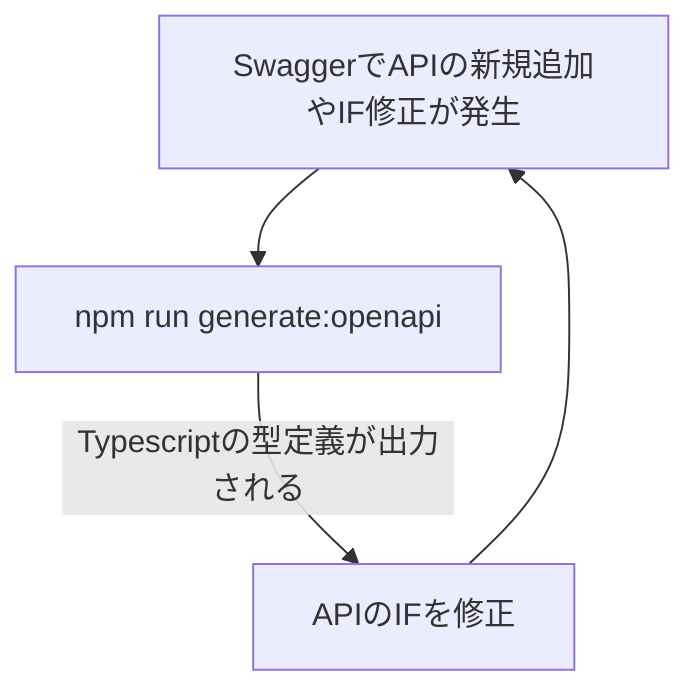

# 概要
基本的な構成は以下リポジトリと同じ構成としている
- https://github.com/hirotaka/bulletproof-vue


# 使用ライブラリ
詳細については、`package.json`を参照して欲しいが、代表的なものを抜粋する
- openapi-fetch
- openapi-typescript
- msw

# OpenAPIとの連携方式
これまで、OpenAPIとの連携に際し、Schemaの定義を手動で行っていたが、
`openapi-typescript`を使用し、Swaggerの設計をもとに出力する`openapi.json`をから、
APIリクエスト・レスポンスのSchemaを導出する形を取る

わざわざ定義する必要がなく、かつ、メンテナンスの中心にOpenAPIを据えることで、
バックエンドとのIF仕様をスピーディに共有できるようになる。

**openapi-typescriptとは**
- [openapi-typescript (7.x)](https://openapi-ts.dev/introduction)
- [openapi-typescriptと型パズルで作るREST APIクライアント](https://zenn.dev/micin/articles/openapi-typescript-with-type-puzzles)

**コマンド**

```
template-vue$ npm run generate:openapi
```


**openapi.jsonを用いたスキーマの生成と、それを活用した実装サイクル**

